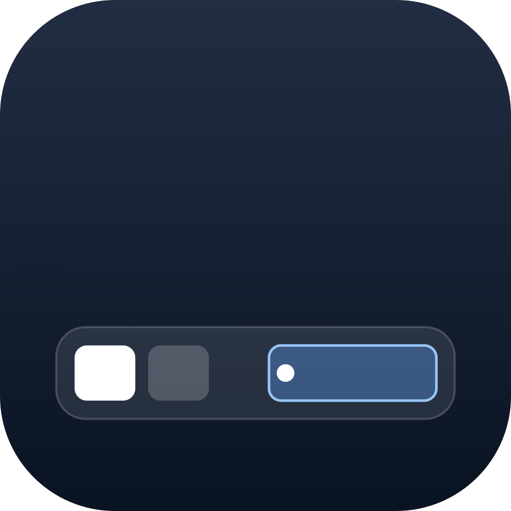
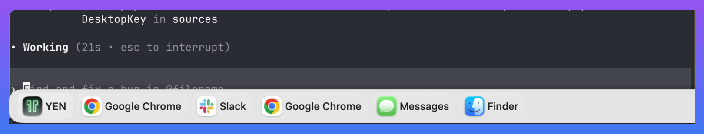

<p align="center">
  
</p>

# DockishOS

<!-- version-badge -->v0.014<!-- /version-badge -->

The macOS Dock shows every app on every Space. DockishOS shows what is open on this Space.

DockishOS is a macOS menu-bar utility that adds a floating, per-display app bar for people who use Spaces heavily. The app is built with SwiftUI and AppKit, targets macOS 14+, and ships as an accessory app with no Dock icon.

## Why DockishOS

**Current-Space-only:** see and switch the windows that matter right now.

**Scroll-to-switch:** scroll over the bar to move between Spaces without opening Mission Control.

**Finder drag-to-pin:** drop `.app` bundles or right-click windows and launcher results to keep important apps close.

<p align="center">
  
</p>

## Download

<!-- download-link -->
[**Download DockishOS v0.014**](https://github.com/8bittts/dockishOS/releases/download/v0.014/DockishOS-0.014.dmg)
<!-- /download-link -->

Download the DMG, drag DockishOS to `/Applications`, and launch it from there. Older builds remain available from [GitHub Releases](https://github.com/8bittts/dockishOS/releases).

Installed app bundles can use Sparkle for update checks. Plain `swift run` builds do not use the bundled app metadata or Sparkle path.

### First launch

Release DMGs are built through the signing and notarization pipeline. Local `--local` and `--unsigned` builds are not notarized, so macOS may show an "unidentified developer" first-launch warning.

If macOS blocks launch, right-click `DockishOS.app` in `/Applications`, choose **Open**, then choose **Open** again in the confirmation dialog. For a local build you created and trust, you can also remove the quarantine flag:

```bash
xattr -dr com.apple.quarantine /Applications/DockishOS.app
```

## Features

- Floating bar on each enabled display.
- Window chips for the current Space.
- Optional pinned app row with drag-to-reorder and Finder `.app` drop support.
- Optional grouping of windows by app.
- Click a chip to activate that app and raise the selected window.
- Right-click chips to close windows or pin/unpin apps.
- Vertical scroll over the bar to switch Spaces.
- Collapse the bar into a bottom-left or bottom-right edge tab.
- Launcher hotkey, default `Option-Space`, for fuzzy-searching installed apps.
- Window switcher hotkey, default `Option-Tab`, for cycling windows in the current Space with Tab, Shift-Tab, arrow keys, Return, and Escape.
- Settings for size, top/bottom placement, titles, badges, hotkeys, login launch, and per-display visibility.

DockishOS does not replace or configure the system Dock. Use System Settings for Dock behavior.

## Permissions

DockishOS asks for Accessibility only when a feature needs it. Accessibility is used to raise or close specific windows and to read optional notification badge text from the Dock accessibility tree.

Window listing and Spaces switching do not require a Screen Recording permission.

Notification badges are off by default. They rely on an undocumented Dock accessibility attribute, so they may stop working on future macOS releases.

## Launcher And Switcher

Press `Option-Space` to open the app launcher. Search matches app names case-insensitively, with exact and prefix matches ranked ahead of word-prefix, contains, and ordered-character matches. Press Return to open the selected result, or right-click a result to pin it to the bar.

Press `Option-Tab` to open the current-Space window switcher. Tab, Shift-Tab, and the arrow keys move selection, Return activates the selected window, and Escape closes the switcher. Change either hotkey from `Cmd-,` Settings.

## Build

```bash
git clone https://github.com/8bittts/dockishOS.git
cd dockishOS
swift test
./scripts/build_and_run.sh
```

`build_and_run.sh` builds a real app bundle at `build/DockishOS.app` and launches it. Use that path for local app testing because Launch Services, Accessibility, login items, icons, and Sparkle behave differently in a plain `swift run` process.

Useful commands:

```bash
swift build
swift test
./scripts/build_and_run.sh --verify
./scripts/build_and_run.sh --logs
./scripts/build-dmg.sh --build-only
```

## Project Layout

- `Sources/DockishOS`: app, menu bar item, bar UI, launcher, switcher, settings, window and Spaces integration.
- `Sources/DockishOSCore`: testable utility logic.
- `Tests/DockishOSCoreTests`: unit tests.
- `Resources/Info.plist`: app bundle metadata and Sparkle settings.
- `public`: README and product media assets.
- `scripts`: local build, DMG, appcast, and release helpers.
- `tools/sparkle`: vendored Sparkle framework used by bundled app builds.

## Contributing

Keep changes native to macOS APIs where possible. Run `swift build` and `swift test` before publishing changes, and use the real bundle script for changes involving Accessibility, login items, app metadata, icons, or updates.

## License

[MIT](LICENSE) © 2026 [8BIT](https://github.com/8bittts)
